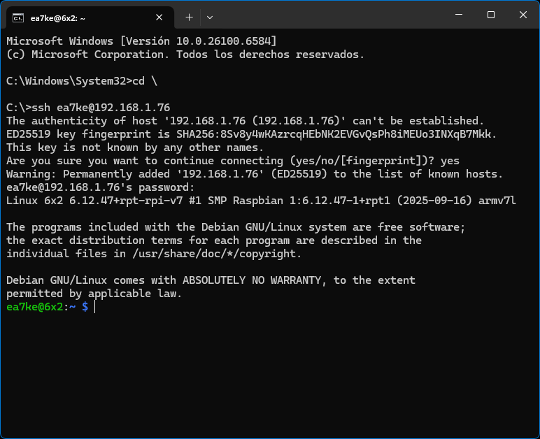
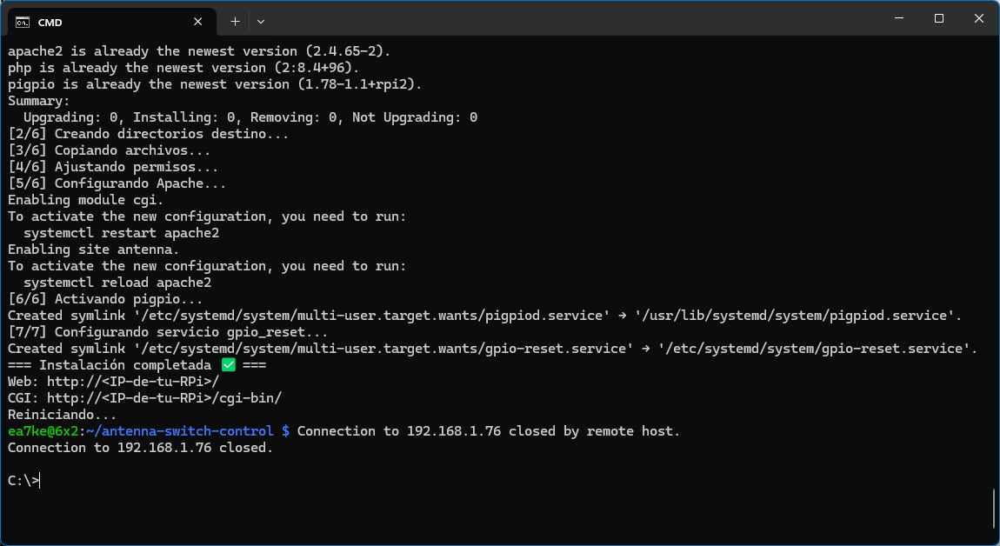

# Guía de instalación de Raspbian Lite en Raspberry Pi

Esta guía documenta paso a paso el proceso de instalación de Raspbian Lite en una Raspberry Pi utilizando Raspberry Pi Imager v2.0.0, incluyendo opciones de personalización como hostname, usuario, Wi-Fi y acceso remoto. Cada paso está ilustrado con capturas de pantalla para facilitar la comprensión.

---

## Paso 1: Selección del modelo de Raspberry Pi

*Comentario pendiente*

---

## Paso 2: Instalación y activación de pigpio

*Comentario pendiente*

---

## Paso 3: Selección del dispositivo Raspberry Pi

*Comentario pendiente*

---

## Paso 4: Selección del sistema operativo

*Comentario pendiente*

---

## Paso 5: Selección de Raspbian Lite

*Comentario pendiente*

---

## Paso 6: Selección del dispositivo de almacenamiento

*Comentario pendiente*

---

## Paso 7: Configuración del hostname

*Comentario pendiente*

---

## Paso 8: Configuración de localización

*Comentario pendiente*

---

## Paso 9: Creación de usuario

*Comentario pendiente*

---

## Paso 10: Configuración de Wi-Fi

*Comentario pendiente*

---

## Paso 11: Activación de SSH

*Comentario pendiente*

---

## Paso 12: Activación de Raspberry Pi Connect

*Comentario pendiente*

---

## Paso 13: Confirmación de configuración antes de escribir

*Comentario pendiente*

---

## Paso 14: Advertencia antes de sobrescribir el dispositivo

*Comentario pendiente*

---

## Paso 15: Inicio del proceso de escritura

*Comentario pendiente*

---

## Paso 16: Progreso de escritura

*Comentario pendiente*

---

## Paso 17: Finalización del proceso

*Comentario pendiente*

---

## Paso 18: Verificación de dispositivos en red con Advanced IP Scanner

*Comentario pendiente*

---

## Paso 19: Conexión SSH desde Windows (usuario ez7ke)

*Comentario pendiente*

---

## Paso 20: Conexión SSH desde Windows (usuario pi)

*Comentario pendiente*

---
