# Guía de instalación de Raspbian Lite en Raspberry Pi

Esta guía documenta paso a paso el proceso de instalación de Raspbian Lite en una Raspberry Pi utilizando Raspberry Pi Imager v2.0.0, incluyendo opciones de personalización como hostname, usuario, Wi-Fi y acceso remoto. Cada paso está ilustrado con capturas de pantalla para facilitar la comprensión.

---

## Paso 1: Selección del modelo de Raspberry Pi

*Seleccionamos el modelo de Raspberry que vamos a usar. Yo lo he hecho con la RPi 3 pero debería funcionar en todas.*

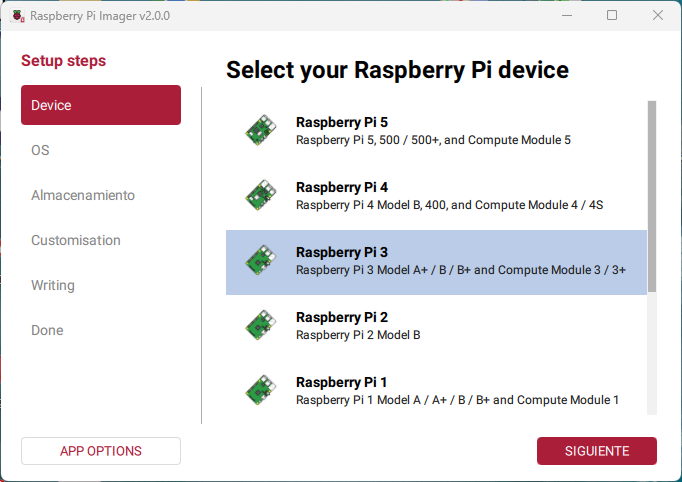

---

## Paso 2: Selección de la versión de SO a instalar

*Vamos a instalar una versión ligera para que funcione en cualquier RPi y admeás en tarjetas desde 8Gb. Por lo tanto en OTHERS elegimos Raspbian Lite 32bits (no lo he probado con la de 64 bits)*

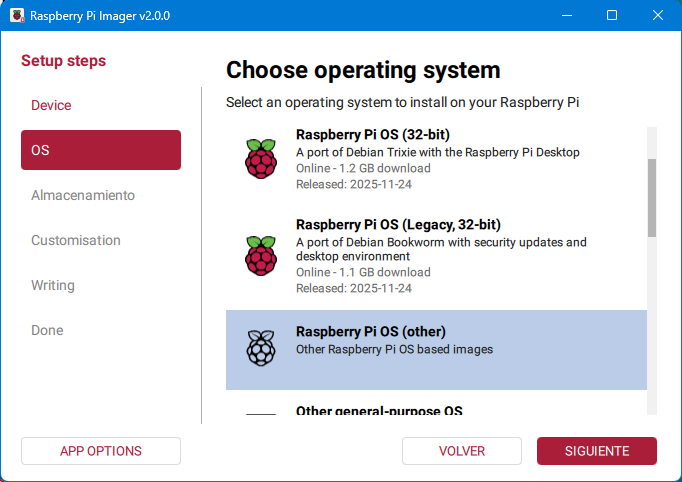

---

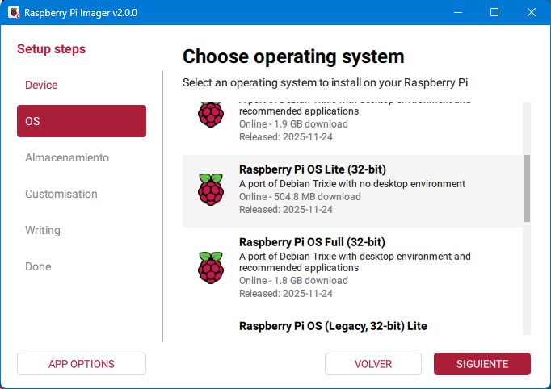

---

## Paso 3: Selección de la tarjeta SD

*Elegimos la unidad donde tenemos la SD*

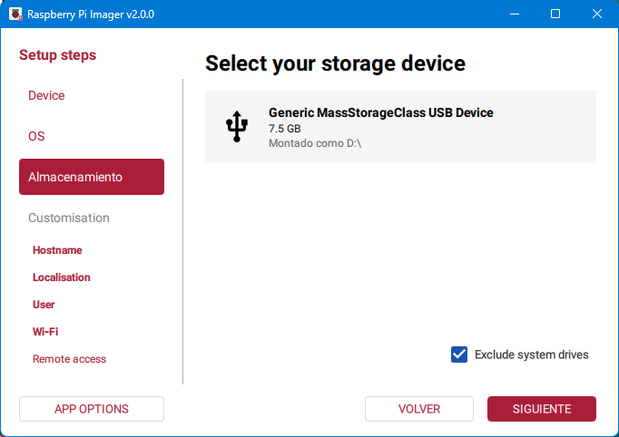

---

## Paso 4: Ponemos el nombre de nuestra PI

*Elegimos un nombre para nuestra RPi. Es el nombre del host en la red*

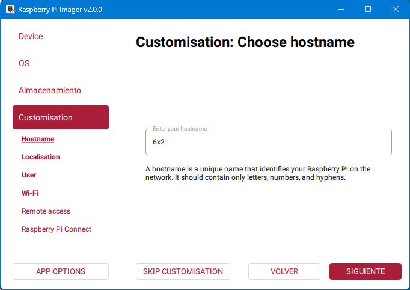

---

## Paso 5: Selección regional

*Si estamos en España lo más lógico es poner las opciones mostradas. Pero que cada uno elija lo que quiera*

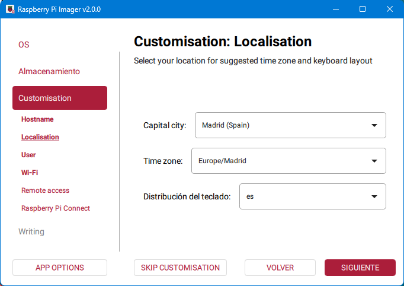

---

## Paso 6: Configuración del usuario

*Creamos el primer usuario. Normalmente el nuestro y la contraseña que queramos. Es importante guardarla ya que será con la que accedamos para configurarla*

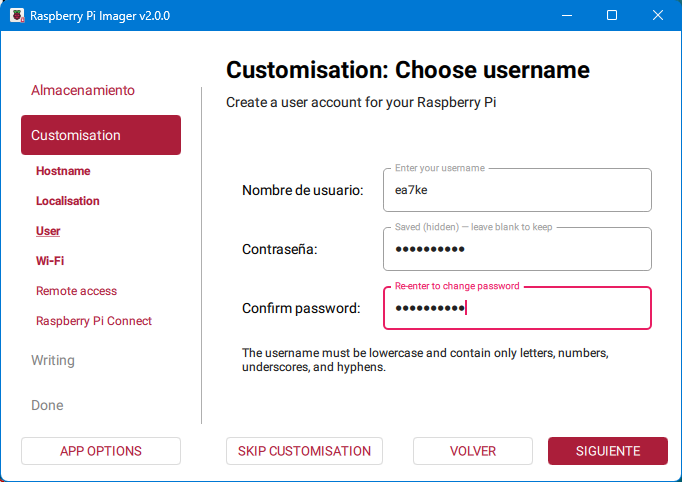

---

## Paso 7: Configuración de la red WiFi

*Aunque yo la tengo conectada por cable, también conviene (si quieres) aprovechar para configurarle al red WiFi*

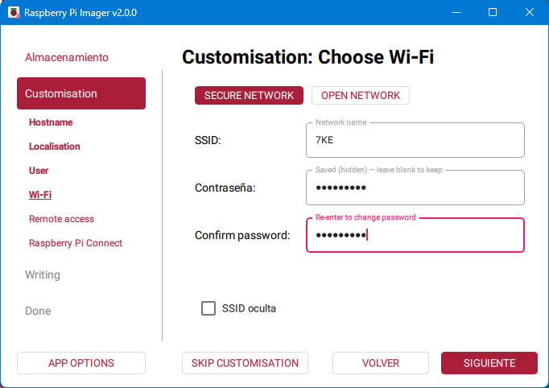

---

## Paso 8: Activar servicio de SSH

*Para quien no conozca ssh, es el servicio por el que nos conectaremos para poder configurar desde terminal la RPi*

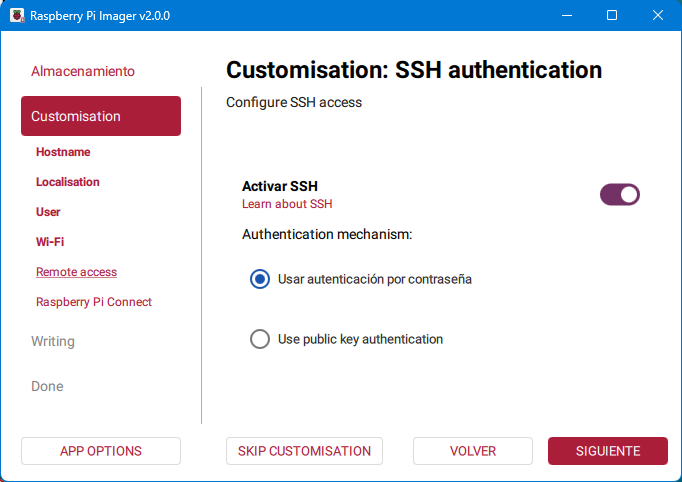

---

## Paso 9: Activación de Raspberry Pi Connect

*No conozco bien el funcionamiento, pero permite conectarnos a la RPi desde cualquier sitio remoto mediante una web. Lo dejo a elección de cada uno su activación o no. En principio yo no lo he activado ya que no lo necesito.*

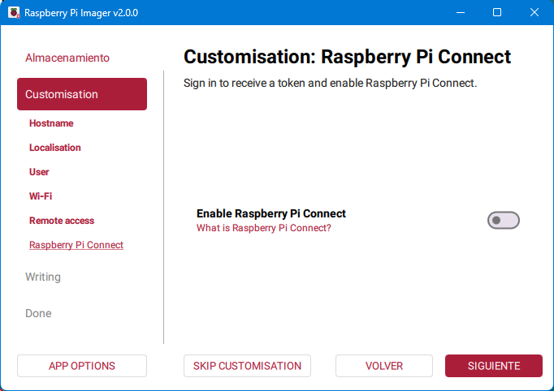

---

## Paso 10: Confirmación de configuración antes de escribir

*Repasamos la configuración y si está correcto aceptamos*

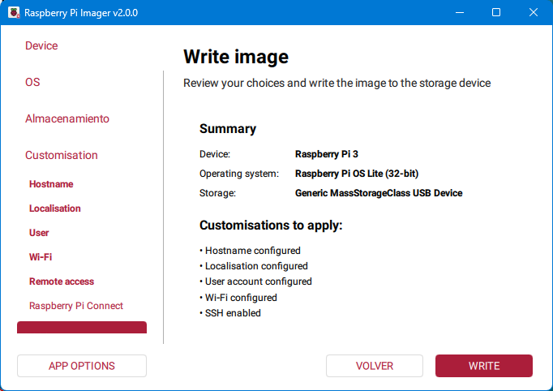

---

*¿¡Seguro!?*

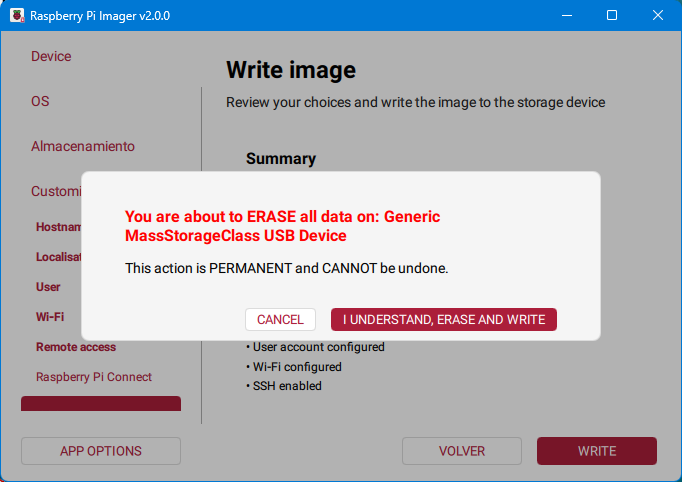

---

## Paso 13: Inicio del proceso de escritura

*Esperamos que termine de escribir*

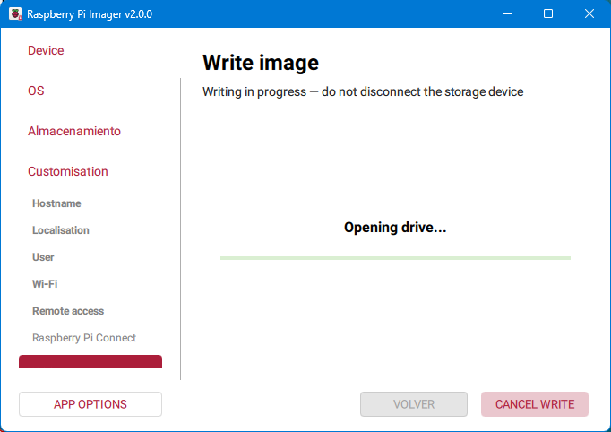

---

*Comentario pendiente*

---

*Retiramos la tarjeta SD y la insertamos en la RPi. Esperamos que arranque y buscamos alguna de sus IPs*

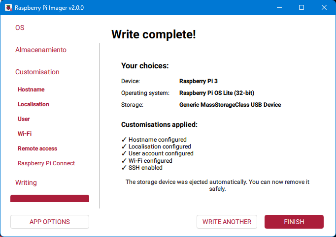

---

## Paso 14: Localizar la IP de la Raspberry

*Necesitamos saber qué IP ha obtenido del servidor DHCP de nuestro router. Para ello yo uso la herramienta Advanced IP Scanner que es gratuita y se puede descargar de la web*

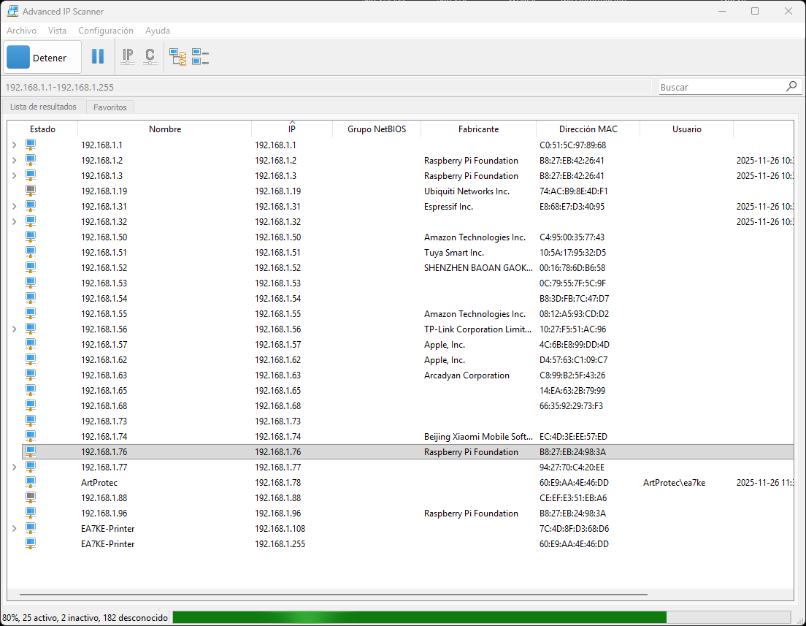

---

## Paso 15: Conexión SSH desde Windows

*Nos conectamos a la  RPi escribiendo lo que está marcado de color verde.*
CD \ (intro)
*Después, *
SSH nuestrousuario@IPdelaRaspbrry
*nos pedirá la password que habíamos puesto, y...*
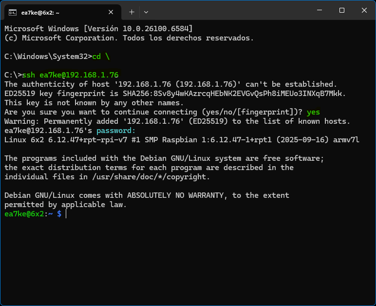
---

*Ya estamos conectados a la RPi. Para la instalación del control del conmutador de antenas, seguid los siguientes pasos.*

